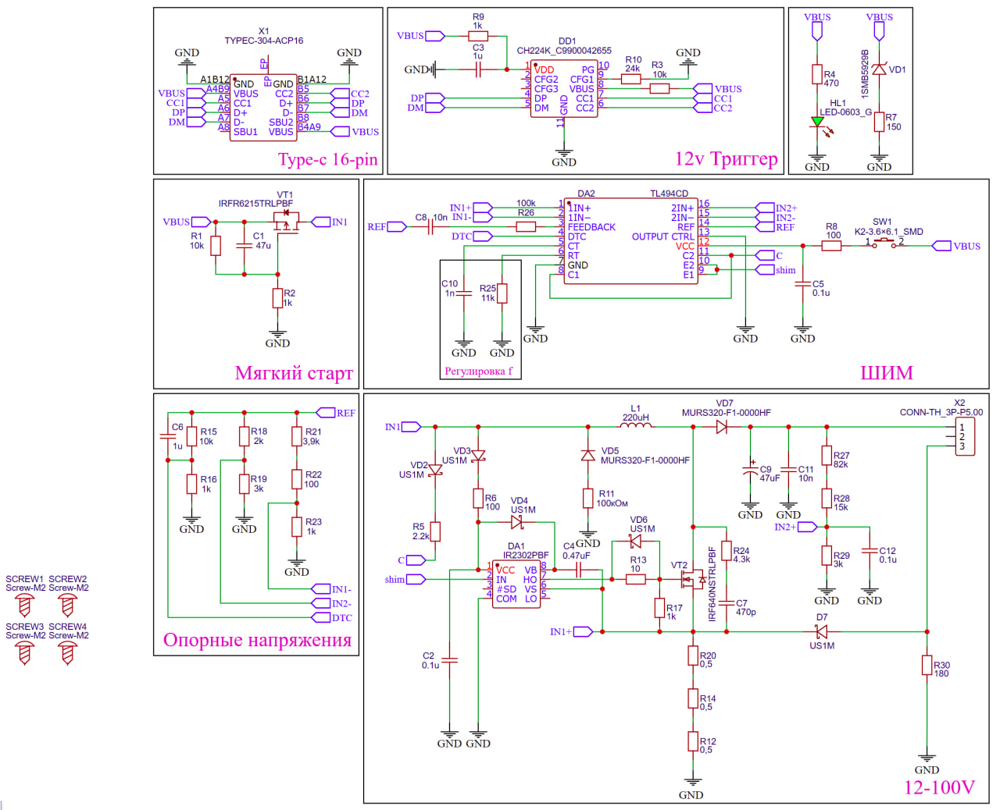
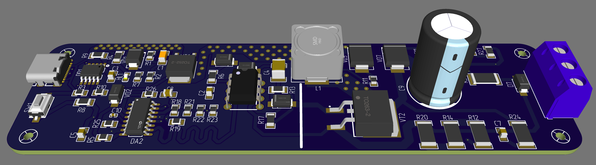
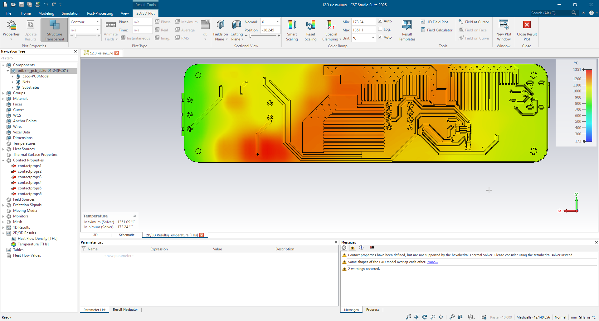
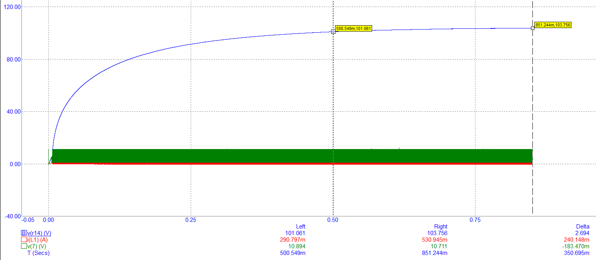
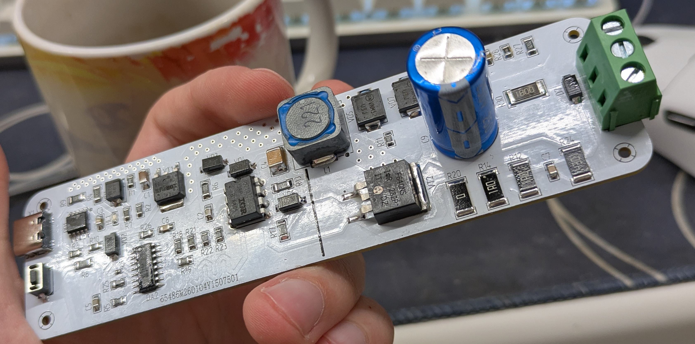
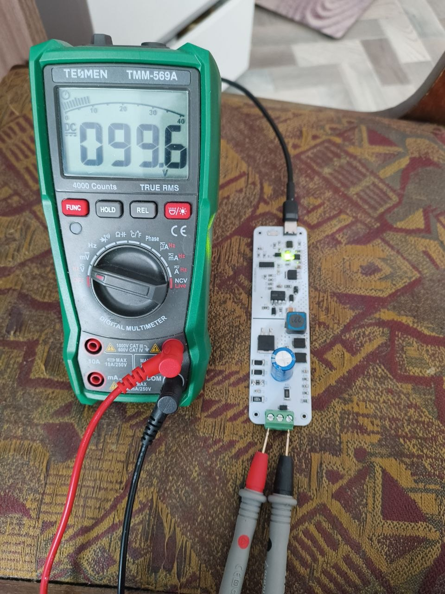

# Лабораторный стенд для испытания высоковольтных радиоэлементов (HV Test Stand)

Специализированный лабораторный прибор для проведения комплексных испытаний высоковольтных полупроводниковых компонентов и диэлектрических материалов (измерение токов утечки, определение напряжения пробоя). 

Проект охватывает полный цикл разработки устройства: от проектирования схемы и симуляции физических процессов до конструирования корпуса, подготовки файлов производства и натурных испытаний готового стенда.

Разработчики: **[aiurat](https://github.com/aiurat)** и **[ilyakorni](https://github.com/ilyakorni)**.

---

## 1. Схемотехника и трассировка платы (EasyEDA)

Электронный узел устройства спроектирован в среде **EasyEDA**:
* **Схема:** Импульсный повышающий преобразователь (Boost Converter) на базе ШИМ-контроллера **TL494 (DA2)** и драйвера затвора **IR2302 (DA1)**. Первичное питание осуществляется через интерфейс USB Type-C (**X1**) с триггером быстрой зарядки **CH224K (DD1)**, запрашивающим профиль питания 12 В (до 2 А).
* **Плата:** Двухслойная печатная плата (FR-4) со встроенным планарным радиатором (медными полигонами без паяльной маски) для пассивного охлаждения силового ключа **VT2 (IRF640)**.

  

  

---

## 2. Симуляция физических процессов

Перед отправкой платы в производство было проведено компьютерное моделирование ключевых узлов устройства:

### Тепловое моделирование планарного радиатора (CST Studio Suite)
Для качественной оценки эффективности охлаждающего медного полигона была проведена тепловая симуляция в 3 итерации:
1. **Итерация 1 (Базовая):** Упрощенный расчет на пустом текстолите для оценки векторов распространения тепла.
2. **Итерация 2 (Контрольная):** Моделирование платы с компонентами без физического контакта полигона радиатора с платой в расчетной сетке. Это позволило зафиксировать характерный критический перегрев в одной точке при отсутствии теплоотвода.
3. **Итерация 3 (Финальная):** Тепловой контакт был настроен. Добавлены точки нагрева в зоне без радиатора (3 резистора). Симуляция наглядно подтвердила, что в зоне без радиатора образуется сильный перегрев, тогда как планарный медный полигон успешно распределяет и уводит тепло по плате.

  

### Моделирование мягкого старта (Micro-Cap)
Проведено моделирование переходных процессов (*Transient Analysis*) узла мягкого старта на транзисторе **VT1**. Моделирование подтвердило плавное нарастание напряжения на нагрузке и ограничение бросков зарядного тока конденсаторов фильтра, что защищает первичный блок питания от перегрузки при старте.

  

---

## 3. Конструирование корпуса (КОМПАС-3D)

В системе **КОМПАС-3D** спроектирован защитный корпус прибора:
* Конструкция корпуса разделена на отдельные функциональные части (основание, крышка, панели) для удобства 3D-печати.
* В общую механическую сборку (`.a3d`) была импортирована STEP-модель печатной платы (`hv-test-stand-pcb.step`) для контроля соосности разъемов, клемм, кнопок и крепежных отверстий.

---

## 4. Производство и финальные испытания

По подготовленной документации (Gerber-файлы, BOM-таблица, технологическая маршрутная карта) плата была успешно изготовлена, смонтирована и протестирована:
* Проведены замеры выходного напряжения с помощью мультиметра.
* Зафиксирована стабильная работа преобразователя и генерация выходного напряжения **99.6 В** при питании от интерфейса USB-C.

  

  

---

## 5. Навигация по репозиторию

* 🔌 **[Электроника](./electronics/)** — принципиальная схема и печатная плата в EasyEDA.
* 📈 **[Симуляции](./electronics/simulation/)** — подробные отчеты и файлы тепловых расчетов (CST) и мягкого старта (Micro-Cap).
* ⚙️ **[Механика](./mechanical/)** — 3D-модели корпуса (КОМПАС-3D) и STEP-файл платы.
* 🛠️ **[Производство](./production/)** — Gerber-файлы, чертежи PDF, спецификация (BOM) со ссылками и фотографии готового прибора.
* 📄 **[Документация](./docs/)** — подробное [описание работы схемы](./docs/readme.md).

## Лицензия

Copyright (c) 2026 Айрат Ялалетдинов, Илья Корнилов

Этот исходный документ описывает открытое аппаратное обеспечение (Open Hardware) и распространяется под лицензией CERN-OHL-P v2. 
Вы можете распространять и изменять этот исходный документ, а также производить на его основе продукты в соответствии с 
условиями лицензии CERN-OHL-P v2 (https://cern.ch/cern-ohl).

Этот исходный документ распространяется БЕЗ КАКИХ-ЛИБО ЯВНЫХ ИЛИ ПОДРАЗУМЕВАЕМЫХ ГАРАНТИЙ, 
ВКЛЮЧАЯ ГАРАНТИИ ТОВАРНОЙ ПРИГОДНОСТИ, УДОВЛЕТВОРИТЕЛЬНОГО КАЧЕСТВА ИЛИ СООТВЕТСТВИЯ 
КОНКРЕТНЫМ ЦЕЛЯМ. Пожалуйста, ознакомьтесь с условиями CERN-OHL-P v2 для получения подробной информации.
