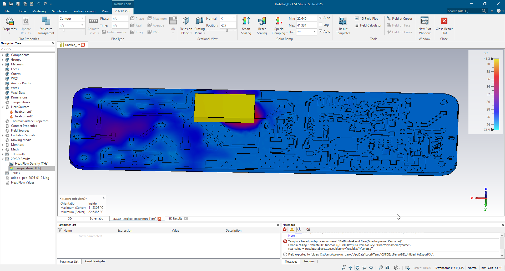
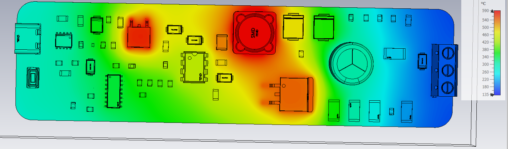
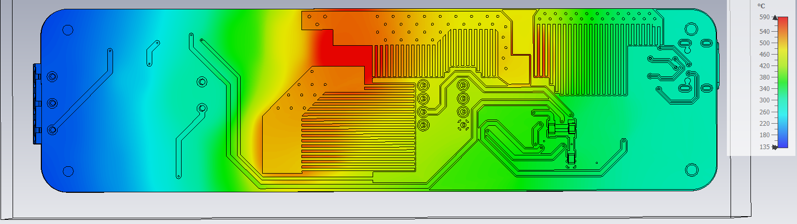
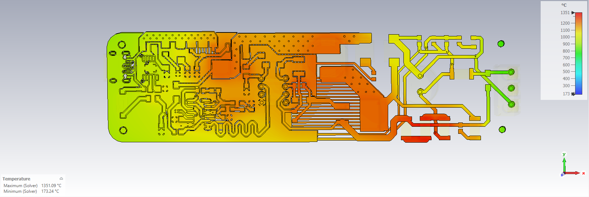
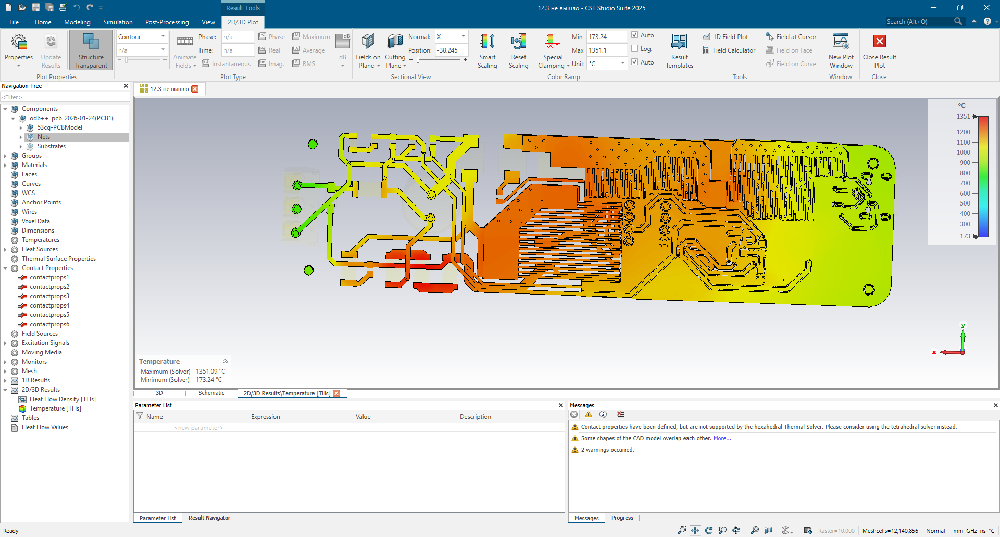
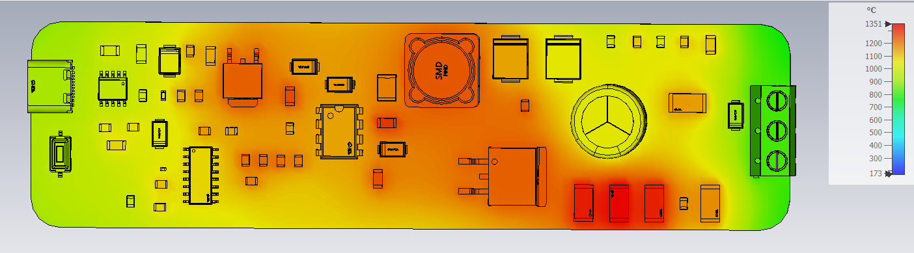

# Моделирование и симуляция физических процессов

В данном разделе представлены результаты теплового моделирования охлаждающей способности планарного радиатора в среде **CST Studio Suite**, а также схемотехнического анализа узла мягкого старта в программе **Micro-Cap**.

---

## 1. Тепловой анализ планарного радиатора (CST Studio Suite)

**Цель исследования:** Качественная оценка эффективности работы планарного радиатора (медного полигона печатной платы) и визуализация путей распределения тепла по плате.

*Примечание: Так как точные значения тепловыделения реальных компонентов на этапе проектирования могут варьироваться, тепловая мощность в моделях задавалась с избыточным запасом. Абсолютные значения температур в симуляциях носят номинальный характер и служат для демонстрации градиентов теплоотвода.*

### Итерация 1: Упрощенная базовая модель
На первом этапе была подготовлена упрощенная модель, состоящая только из текстолитового основания и медных проводников, без учета корпусов радиокомпонентов.
* **Методика:** В качестве источника тепла в CST Studio Suite был создан условный твердотельный объект (кубик), расположенный непосредственно в зоне планарного радиатора.
* **Результат:** Зафиксирован нагрев в самой горячей точке до **41.3 °C**. Модель позволила оценить базовые направления растекания тепла.
* **Выявленные недостатки:** Для реалистичного анализа необходимо использовать полную 3D-сборку платы с компонентами и задать несколько распределенных точек нагрева.

  

---

### Итерация 2: Модель с компонентами (без теплового контакта)
На этом этапе была задействована детализированная 3D-модель платы со всеми установленными радиоэлементами.
* **Методика:** Выделены 3 характерные точки нагрева на корпусах компонентов, расположенных в зоне планарного радиатора. На них была подана тепловая нагрузка.
* **Результат:** Зафиксирован сильный локальный перегрев (пиковое значение **590 °C**) из-за завышенной мощности источников.
* **Выявленные особенности и дефекты:** 
  При анализе модели обнаружилось, что медный полигон радиатора и подложка печатной платы физически не соприкасались в расчетной сетке. Данная ошибка позволила использовать итерацию в качестве «контрольной группы»: на тепловой карте отчетливо видно, как тепло концентрируется исключительно в точках нагрева и не уходит в плату из-за отсутствия теплового контакта.
* **План действий:** Обеспечить корректное механическое и тепловое сопряжение проводников с платой для сравнения результатов.

  
  

---

### Итерация 3: Финальная модель (с тепловым контактом)
В финальной версии модели были устранены все геометрические несоответствия и добавлены дополнительные тепловые источники для сравнительного анализа.
* **Методика:** 
  * Настроено корректное сопряжение (тепловой контакт) радиаторов с поверхностью печатной платы.
  * Добавлены новые точки нагрева, в том числе в области платы, где планарный радиатор отсутствует (группа из 3 рядом стоящих резисторов).
* **Результат:** 
  Из-за улучшения теплопередачи и добавления источников пиковая температура на модели составила **1351 °C** (номинальное значение). Симуляция наглядно продемонстрировала разницу процессов:
  * В зоне трех резисторов (без радиатора) наблюдается критическая локальная точка перегрева с резким градиентом.
  * В зонах компонентов, сопряженных с медными полигонами, тепло эффективно распределяется по площади радиатора и рассеивается в объеме платы.
* **Вывод:** Тестовое моделирование завершено, работоспособность и высокая эффективность планарного радиатора успешно подтверждены качественным анализом.

#### Тепловые карты проводящего рисунка (медных слоев):

  
  

#### Тепловые карты всей платы в сборе:

  
  

---

## 2. Схемотехническое моделирование мягкого старта (Micro-Cap)

Для проверки работоспособности узла плавного пуска первичных цепей питания было проведено моделирование переходных процессов (*Transient Analysis*) в среде **Micro-Cap**.

* **Суть процесса:** При подаче питания цепи смещения в затворе транзистора **VT1** обеспечивают постепенное открытие его канала. Плавное нарастание проводимости исключает броски тока при зарядке емкостей фильтра и защищает первичный источник (USB Type-C) от перегрузки.
* **Результат симуляции:** На графике переходного процесса отчетливо видны плавное нарастание напряжения на нагрузке и ограничение пикового зарядного тока емкостей до безопасных значений. Схема полностью подтвердила свою расчетную эффективность.

  

